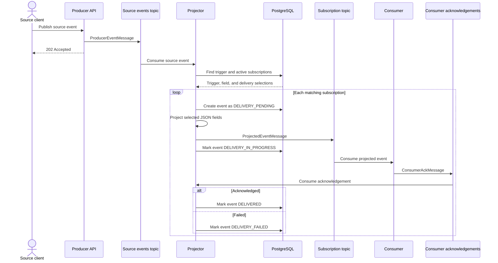
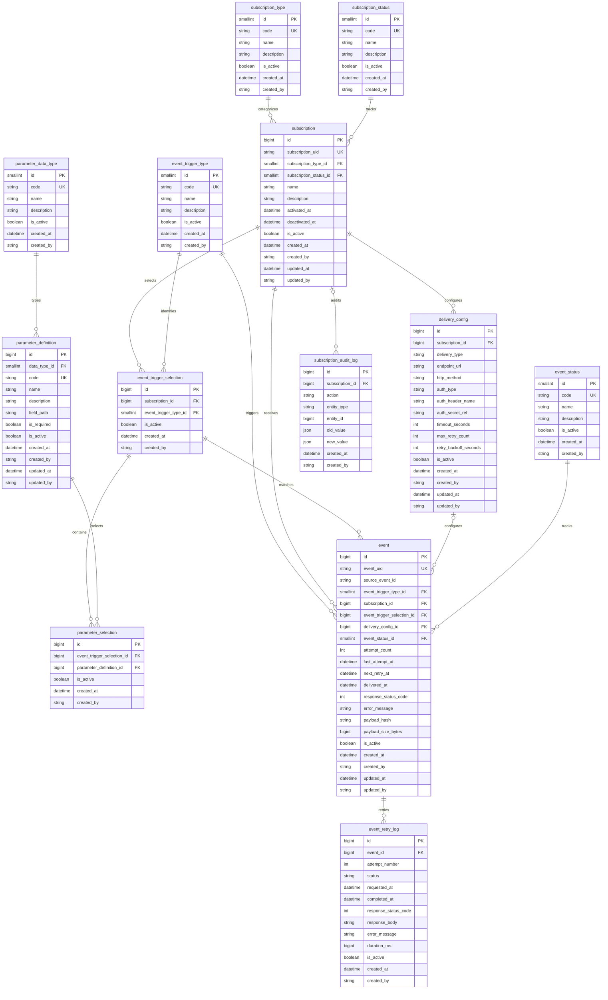
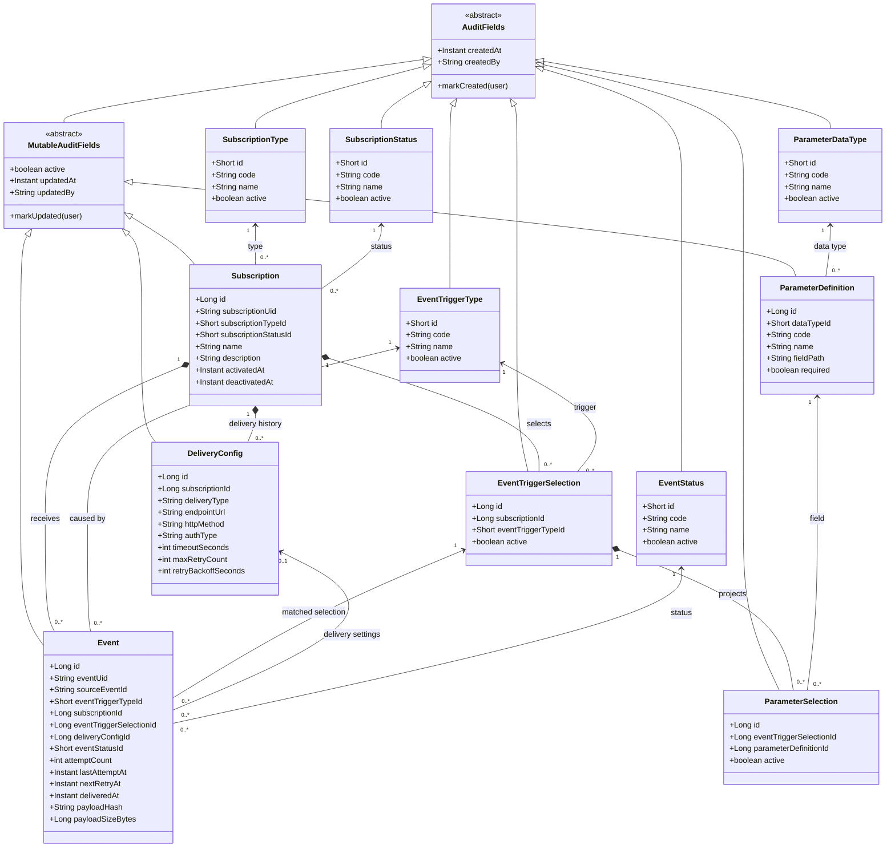

# Konductor UML diagrams

These diagrams reflect the current repository structure. GitHub renders each Mermaid block directly in the document.

## System architecture

```mermaid
flowchart LR
    operator["Workspace operator"]
    sourceClient["Source client"]

    subgraph uiSystem["Konductor UI"]
        nextUi["Next.js subscription UI"]
        cognito["Amazon Cognito"]
        apiProxy["Projector API proxy"]
    end

    subgraph producerSystem["Producer service"]
        producerApi["EventProducerController"]
        producerService["EventProducerService"]
    end

    subgraph messaging["Kafka"]
        sourceTopic["konductor.source-events"]
        subscriptionTopic["konductor.subscription.{uid}"]
        ackTopic["konductor.consumer-acks"]
    end

    subgraph projectorSystem["Projector service"]
        subscriptionApi["SubscriptionController"]
        subscriptionService["SubscriptionService"]
        sourceListener["SourceEventListener"]
        projectionService["SourceEventProjectionService"]
        eventPublisher["ProjectedEventPublisher"]
        ackListener["ConsumerAckListener"]
        ackService["ConsumerAckService"]
    end

    postgres[("PostgreSQL")]

    subgraph consumerSystem["Consumer service"]
        projectedListener["ProjectedEventListener"]
        consumerService["ProjectedEventConsumerService"]
        ackPublisher["ConsumerAckPublisher"]
    end

    operator --> nextUi
    nextUi -->|"sign in and sign up"| cognito
    nextUi -->|"subscription requests"| apiProxy
    apiProxy -->|"REST /api/v1"| subscriptionApi
    subscriptionApi --> subscriptionService
    subscriptionService -->|"configuration data"| postgres

    sourceClient -->|"POST /api/v1/events"| producerApi
    producerApi --> producerService
    producerService -->|"ProducerEventMessage"| sourceTopic
    sourceTopic --> sourceListener
    sourceListener --> projectionService
    projectionService -->|"read selections and store event"| postgres
    projectionService --> eventPublisher
    eventPublisher -->|"ProjectedEventMessage"| subscriptionTopic
    subscriptionTopic --> projectedListener
    projectedListener --> consumerService
    consumerService --> ackPublisher
    ackPublisher -->|"ConsumerAckMessage"| ackTopic
    ackTopic --> ackListener
    ackListener --> ackService
    ackService -->|"update delivery status"| postgres
```

## Event projection and acknowledgement sequence

## PostgreSQL tables

The physical schema is created by `projector/src/main/resources/db/migration/V1__create_tables.sql`. It contains 13 application tables in the `public` schema.

## Projector domain model

The Java entities store foreign-key identifiers rather than JPA object references. The associations below represent the database relationships those identifiers create.

